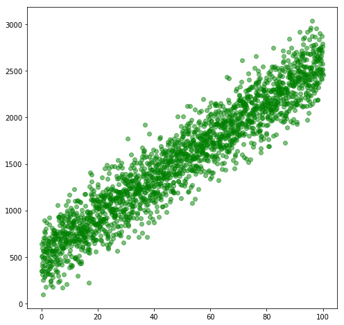
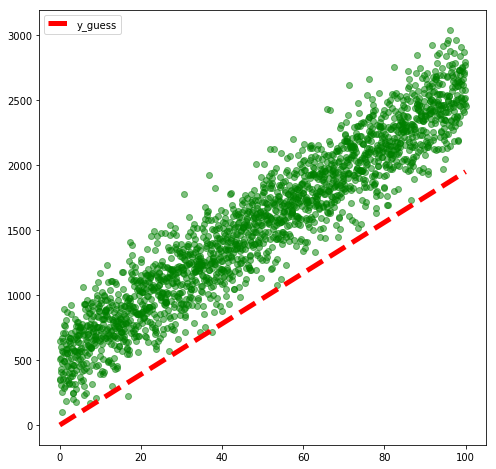
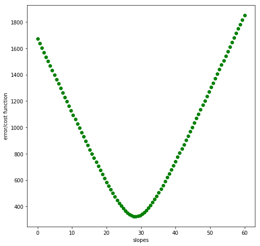
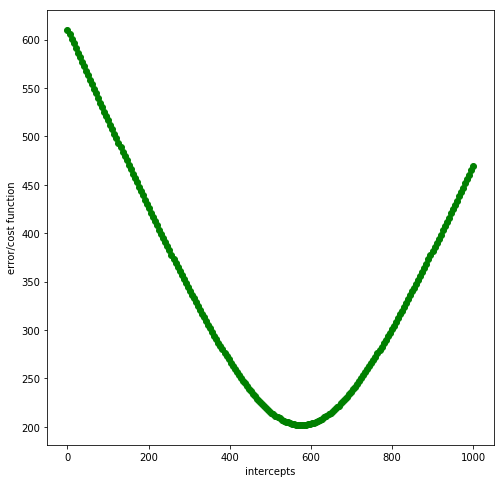

# Gradient Descent

### Questions
* more clarification on partial derivatives, wth?????
* delta_x, delta_y, and started using m and b
* what do all of these symbols, coefficients, constants mean?
* drawing the line between understanding code and math concepts

### Objectives
YWBAT
* define what a cost function is
* explain why gradient descent is so awesome
* implement gradient descent by hand to reduce the error

### Outline
* questions
* make some data
* make a regression model
* calculate the error of a guess
* do some gradient descent
* assess/check learning


```python
import pandas as pd
import numpy as np

import matplotlib.pyplot as plt
```


```python
x = np.linspace(0, 100, 2000)
m = np.random.randint(20, 30) # slope of the line
error = np.random.normal(500, 200, 2000) # adding some noise
```


```python
y = m*x + error # y = mx equation with some error
```


```python
# visualize our data
plt.figure(figsize=(8, 8))
plt.scatter(x, y, c='g', alpha=0.5)
plt.show()
```





```python
# guess a slope
# (y2 - y1)/(x2 - x1)
m_guess = (y[-1] - y[0]) / (x[-1] - x[0])
m_guess
```


    19.47011476231915


```python
y_guess = m_guess*x
```


```python
x[-1], y[-1], x[0], y[0]
```


    (100.0, 2452.953941626552, 0.0, 505.9424653946372)


```python
# visualize our data with our guess line (y_guess)
plt.figure(figsize=(8, 8))
plt.scatter(x, y, c='g', alpha=0.5)
plt.plot(x, y_guess, c='r', linestyle='dashed', label='y_guess', linewidth=5)
plt.legend()
plt.show()
```





```python
def rmse(ytrue, ypred):
    return np.sqrt(np.mean((ytrue - ypred)**2))
```


```python
rmse(y, y_guess)
```


    610.239663767945


```python
# make a function out of the error derivative with respect to m
def drdm(m, ytrue=y, xvals=x, b=0):
    error = rmse(y, m*x)
    mean_residuals = np.mean(y - m*x + b)
    change_in_error = -1.0/error * (mean_residuals)*np.mean(x)
    return change_in_error
```


```python
drdm(30)
```


    -7.329889172274607


```python
slopes = np.linspace(0, 60, 100)
```


```python
errors = []
for slope in slopes:
    error = rmse(y, slope*x)
    errors.append(error)
```


```python
plt.figure(figsize=(8, 8))
plt.scatter(slopes, errors, c='g')
plt.xlabel("slopes")
plt.ylabel("error/cost function")
plt.show()
```





```python
intercepts = np.linspace(0, 1000, 200)
```


```python
errors = []
for intercept in intercepts:
    y_pred = m_guess*x + intercept
    error = rmse(y, y_pred)
    errors.append(error)
```


```python
plt.figure(figsize=(8, 8))
plt.scatter(intercepts, errors, c='g')
plt.xlabel("intercepts")
plt.ylabel("error/cost function")
plt.show()
```





```python
y_pred = 19*x + 570
rmse(y, y_pred)
```


    206.8593658505605


### What we learned
* Visualizations helped understand how we're finding the best fit line
* The minimum values are the least error
* Rolling a marble and seeing where it stops

examples of cost function
* rmse
* rss
* sum_residuals
* negative mean squared error
